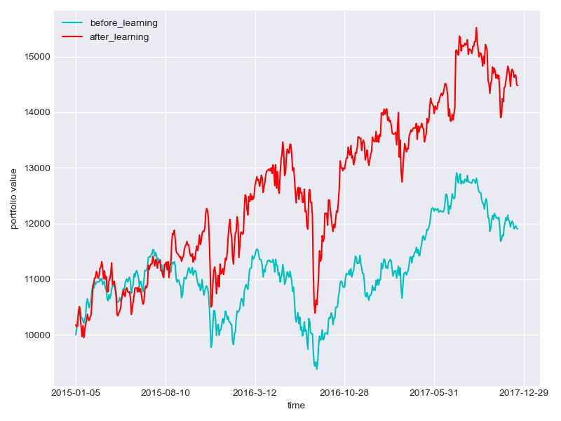
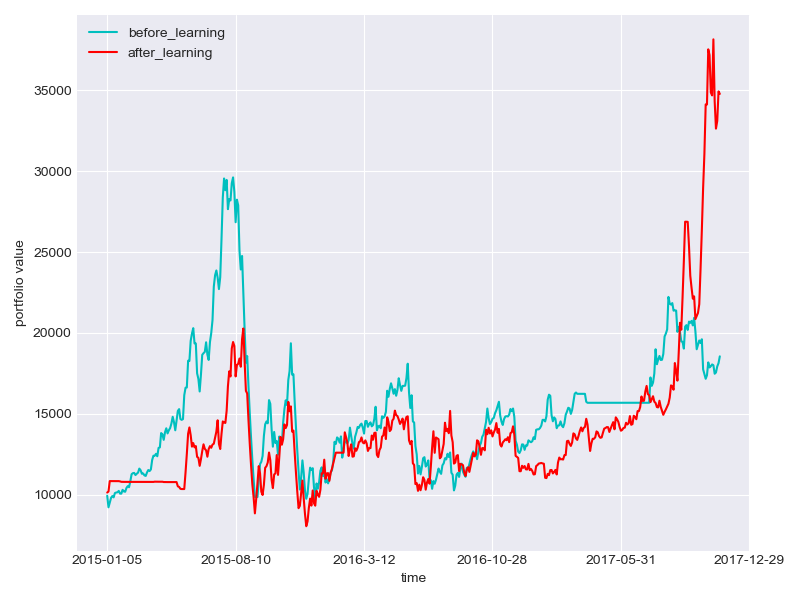
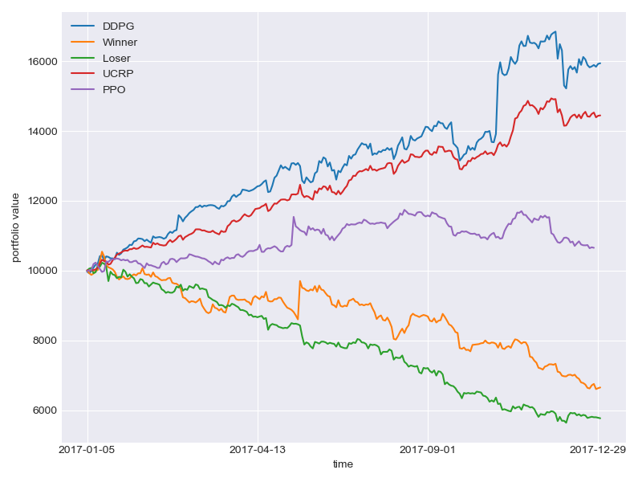
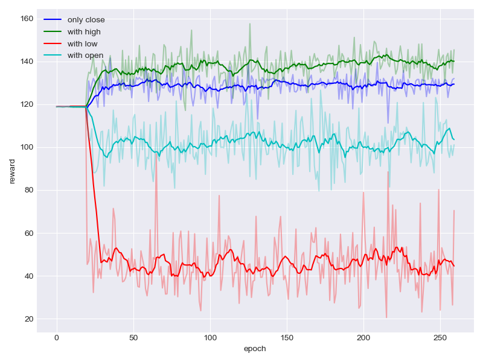

# Source Start Reinforcement Learning in Portfolio Management

Welcome to the Source Start Reinforcement Learning in Portfolio Management repository! We're excited to have you as a potential contributor to our financial AI project that uses deep reinforcement learning for automated portfolio management.


## Table of Contents

- [Introduction](#introduction)
- [Project Inspiration](#project-inspiration)
- [Features](#features)
- [Getting Started](#getting-started)
- [Project Structure](#project-structure)
- [Configuration](#configuration)
- [How to Contribute](#how-to-contribute)
- [Issues and Feature Requests](#issues-and-feature-requests)
- [Results](#results)
- [Code of Conduct](#code-of-conduct)
- [License](#license)

## Introduction

This repository implements cutting-edge deep reinforcement learning algorithms for portfolio management, specifically **Deep Deterministic Policy Gradient (DDPG)** and **Proximal Policy Optimization (PPO)**. The project demonstrates how AI agents can learn to make intelligent trading decisions by analyzing stock market data and optimizing portfolio returns. As part of "Source Start," an open source event organized by CSI SPIT for 1st and 2nd year students, we invite developers, finance enthusiasts, and machine learning practitioners to contribute to this exciting intersection of AI and finance.

## Project Inspiration

This project is **inspired by and builds upon** the groundbreaking research paper:

📄 **"A Deep Reinforcement Learning Framework for the Financial Portfolio Management Problem"** by [Jiang et. al. 2017](https://arxiv.org/abs/1706.10059)

Our implementation extends this work by:
- Adding comprehensive experiments with different hyperparameters
- Supporting both Chinese and American stock markets
- Implementing multiple RL algorithms (DDPG and PPO)
- Providing extensive configuration options
- Adding noise injection for robust training
- Including detailed performance analysis tools

## Features

### ✅ Currently Implemented
- **DDPG Algorithm** - Deep Deterministic Policy Gradient for continuous action spaces
- **PPO Algorithm** - Proximal Policy Optimization for stable training
- **Multi-Market Support** - USA and China stock market data
- **Flexible Configuration** - JSON-based configuration system
- **Noise Injection** - Ornstein-Uhlenbeck noise for exploration
- **Performance Tracking** - Wealth tracking and visualization
- **Model Persistence** - Save and reload trained models
- **Backtesting** - Test strategies on historical data

### 🔬 **Research Components**
- **Feature Engineering** - Multiple technical indicators and price features
- **Model Comparison** - Side-by-side algorithm performance analysis
- **Hyperparameter Tuning** - Systematic exploration of learning parameters
- **Cross-Market Validation** - Testing across different geographical markets

## Getting Started

### Prerequisites
- Python 3.6 or higher
- Basic understanding of reinforcement learning and finance
- Familiarity with TensorFlow and NumPy

### 1. Fork and Clone

1. **Fork the Repository:** Click the "Fork" button on the top right corner of this repository.

2. **Clone Your Fork:**
   ```bash
   git clone https://github.com/your-username/Reinforcement-learning-in-portfolio-management.git
   cd Reinforcement-learning-in-portfolio-management
   ```

### 2. Set Up Environment

1. **Install Dependencies:**
   ```bash
   pip install tensorflow numpy pandas matplotlib tushare
   # For GPU support (optional but recommended)
   pip install tensorflow-gpu
   ```

2. **Download Stock Data:**
   ```bash
   python main.py --mode=download_data
   ```

### 3. Training and Testing

1. **Train the Model:**
   ```bash
   python main.py --mode=train
   ```

2. **Test the Model:**
   ```bash
   python main.py --mode=test
   ```

## Project Structure

```
Reinforcement-learning-in-portfolio-management/
├── main.py                    # Main entry point for training/testing
├── config.json               # Configuration file for experiments
├── agents/                   # RL algorithm implementations
│   ├── ddpg.py              # Deep Deterministic Policy Gradient
│   ├── ppo.py               # Proximal Policy Optimization
│   └── ornstein_uhlenbeck.py # Noise generation for exploration
├── data/                    # Stock market datasets
│   ├── America.csv          # US stock data
│   ├── China.csv            # Chinese stock data
│   ├── download_data.py     # Data downloading utilities
│   └── environment.py       # Trading environment simulation
├── result/                  # Training results and visualizations
├── saved_network/           # Saved model checkpoints
└── summary/                 # Training summaries and logs
```

## Configuration

The `config.json` file controls all experimental parameters:

```json
{
    "data": {
        "start_date": "2015-01-01",
        "end_date": "2018-01-01",
        "market_types": ["stock"],
        "ktype": "D"
    },
    "session": {
        "start_date": "2015-01-05",
        "end_date": "2017-01-01",
        "market_types": "America",
        "codes": ["AAPL", "ADBE", "BABA", "SNE", "V"],
        "features": ["close"],
        "agents": ["CNN", "DDPG", "3"],
        "epochs": "10000",
        "noise_flag": "False",
        "record_flag": "False",
        "plot_flag": "False",
        "reload_flag": "False",
        "trainable": "True",
        "method": "model_free"
    }
}
```

### Configuration Options:
- **noise_flag**: Add Ornstein-Uhlenbeck noise to actions
- **record_flag**: Save trading details as CSV files
- **plot_flag**: Generate wealth trend plots
- **reload_flag**: Load previously saved models
- **trainable**: Enable parameter updates during training
- **method**: Choose between model-free and model-based approaches

## How to Contribute

We welcome contributions from the community! To contribute:

1. **Create a New Branch:**
   ```bash
   git checkout -b feature/my-contribution
   ```

2. **Make Your Changes:** Work on your contribution and test thoroughly.

3. **Commit Your Changes:**
   ```bash
   git commit -m "Add: Description of your contribution"
   ```

4. **Push to Your Fork:**
   ```bash
   git push origin feature/my-contribution
   ```

5. **Create a Pull Request:** Submit a PR with a detailed description of your changes.

## Issues and Feature Requests

### 🐛 Known Issues
1. **TensorFlow Version Compatibility** - Code needs updating for TensorFlow 2.x
2. **Data Download Dependencies** - Tushare API requires authentication
3. **Memory Usage** - Large datasets can cause memory issues
4. **Model Convergence** - Some configurations may not converge reliably
5. **Limited Documentation** - Code comments and inline documentation needed

### 🆕 Feature Requests

#### 🎯 Beginner-Friendly Features
- **Code Documentation** - Add comprehensive docstrings and comments
- **Environment Setup Script** - Automated dependency installation
- **Data Preprocessing Pipeline** - Better data cleaning and normalization
- **Visualization Improvements** - Enhanced plotting and analysis tools
- **Configuration Validation** - Input validation for config.json
- **Tutorial Notebooks** - Jupyter notebooks explaining concepts

#### 🔥 Intermediate Features
- **Additional RL Algorithms** - Implement A3C, SAC, TD3 algorithms
- **Feature Engineering** - Add technical indicators (RSI, MACD, Bollinger Bands)
- **Risk Management** - Implement stop-loss and position sizing
- **Multi-Asset Support** - Extend beyond stocks (crypto, forex, bonds)
- **Real-time Data Integration** - Live market data feeds
- **Hyperparameter Optimization** - Automated hyperparameter tuning

#### 🚀 Advanced Features
- **Deep Learning Enhancements** - LSTM, Transformer architectures
- **Multi-Agent Systems** - Ensemble of competing agents
- **Options and Derivatives** - Support for complex financial instruments
- **Sentiment Analysis Integration** - News and social media sentiment
- **Federated Learning** - Privacy-preserving multi-party training
- **High-Frequency Trading** - Microsecond-level decision making

### 🔧 Technical Improvements
- **TensorFlow 2.x Migration** - Update to modern TensorFlow
- **PyTorch Implementation** - Alternative deep learning framework
- **GPU Optimization** - Better GPU utilization and memory management
- **Distributed Training** - Multi-GPU and multi-node training
- **Model Compression** - Quantization and pruning for deployment
- **CI/CD Pipeline** - Automated testing and deployment
- **Docker Containerization** - Reproducible development environment
- **Cloud Integration** - AWS/GCP deployment capabilities

### 📊 Research and Analysis
- **Benchmarking Suite** - Compare against traditional strategies
- **Risk-Adjusted Metrics** - Sharpe ratio, maximum drawdown analysis
- **Market Regime Detection** - Adapt to bull/bear markets
- **Transfer Learning** - Apply models across different markets
- **Explainable AI** - Understand agent decision-making process
- **Robustness Testing** - Performance under market stress conditions

### 🌍 Data and Markets
- **Global Markets** - European, Asian, emerging markets
- **Alternative Data** - Satellite imagery, web scraping
- **ESG Integration** - Environmental, social, governance factors
- **Cryptocurrency Support** - Bitcoin, Ethereum, DeFi protocols
- **Commodity Trading** - Oil, gold, agricultural products
- **Fixed Income** - Bond trading and yield curve strategies

## Results

The project demonstrates strong performance across different markets:

+ **Training Results (USA)**
  

+ **Training Results (China)**
  

+ **Backtest Performance (USA)**
  

+ **Feature Impact Analysis**
  

*Additional results and detailed analysis can be found in the [research paper](https://arxiv.org/abs/1808.09940).*

## Quick Start for Contributors

### For Machine Learning Engineers
1. Focus on algorithm implementation and optimization
2. Work with TensorFlow/PyTorch model architectures
3. Implement new RL algorithms and training strategies
4. Optimize performance and memory usage

### For Finance Professionals
1. Contribute domain expertise on trading strategies
2. Validate model outputs against financial theory
3. Add risk management and portfolio construction features
4. Help with market data analysis and interpretation

### For Data Scientists
1. Improve data preprocessing and feature engineering
2. Add visualization and analysis tools
3. Implement statistical validation methods
4. Work on model evaluation and benchmarking

### For Software Developers
1. Improve code structure and documentation
2. Add testing frameworks and CI/CD pipelines
3. Create web interfaces and deployment tools
4. Work on scalability and performance optimization

## Code of Conduct

Please review our [Code of Conduct](CODE_OF_CONDUCT.md) before contributing. We aim to create a welcoming and inclusive community where everyone can learn and contribute to the exciting field of financial AI.

## License

This project is licensed under the MIT License. See the [LICENSE](LICENSE) file for details.

---

**⚠️ Disclaimer**: This project is for educational and research purposes only. It should not be used for actual financial trading without proper risk assessment and professional advice. Always consult qualified financial advisors before making investment decisions.

Thank you for participating in "Source Start" organized by CSI SPIT! We look forward to your contributions to help advance the field of AI in finance. Whether you're a beginner in machine learning or an experienced quantitative analyst, there's something meaningful for everyone to contribute. Let's build the future of intelligent trading together! 📈🤖

**Happy coding and successful trading!** 🚀💰

```
python main.py --mode=test
```
+ noise_flag=True: actions produced by RL agents are distorted by adding UO noise.
+ record_flag=True: trading details would be stored as a csv file named by the epoch and cumulative return each epoch.
+ plot_flag=True: the trend of wealth would be plot each epoch.
+ reload_flag=True: tensorflow would search latest saved model in ./saved_network and reload.
+ trainable=True: parameters would be updated during each epoch.
+ method=model_based: the first epochs our agents would try to imitate a greedy strategy to quickly improve its performance. Then it would leave it and continue to self-improve by model-free reinforcement learning.

## Result
+ Training data (USA)
  
+ Training data (China)
  

+ Backtest (USA)
  

+ APV under different feature combinations
  

**The other results can be found in our report.**(https://arxiv.org/abs/1808.09940).


## Contribution

### Contributors

* ***Zhipeng Liang***
* ***Kangkang Jiang***
* ***Hao Chen***
* ***Junhao Zhu***
* ***Yanran Li***
### Institutions

+ ***AI&FintechLab of Likelihood Technology***
+ ***Sun Yat-sen University***

## Acknowledegment

We, CSI SPIT would like to say thanks to ***Mingwen Liu*** from ***ShingingMidas Private Fund***, ***Zheng Xie*** and ***Xingyu Fu*** from ***Sun Yat-sen University*** for their generous guidance throughout the project.

## Set up

Python Version

+ ***3.6***

Modules needed

+ ***tensorflow(tensorflow-gpu)***
+ ***numpy*** 
+ ***pandas*** 
+ ***matplotlib***

## Contact

+ liangzhp6@mail2.sysu.edu.cn
+ jiangkk3@mail2.sysu.edu.cn
+ chenhao348@mail2.sysu.edu.cn
+ zhujh25@mail2.sysu.edu.cn
+ liyr8@mail2.sysu.edu.cn
